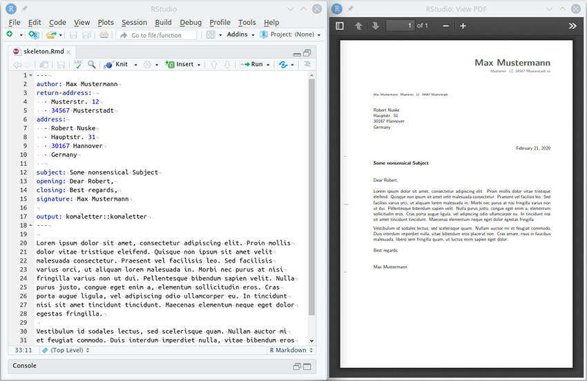

## komaletter: Simply Beautiful PDF Letters from Markdown

<!-- badges: start -->
[](https://github.com/rnuske/komaletter/actions)
[](https://cloud.drone.io/rnuske/komaletter)
[](https://www.gnu.org/licenses/gpl-3.0.html) 
[](https://cran.r-project.org/package=komaletter) 
[](https://cran.r-project.org/package=komaletter) 
[](https://doi.org/10.5281/zenodo.1221316)
<!-- badges: end -->


### Motivation
Simple letters tend to look very much alike. They are either determined by a 
standard eg. window envelope style or writer's preferences. Since the layout 
is fixed, letters can be written perfectly in R Markdown.

The [KOMA-Script LaTeX Bundle](https://www.komascript.de) provides layouts for
many common window envelope types (German, US, French, Japanese, ...) and the
possibility to define your own layout. The *komaletter* package also provides
it's own default letter layout loosely based on DIN 5008B.

This package is an adaptation of the
[linl](https://cran.r-project.org/package=linl) package
for international writers. linl itself is based on the
[pandoc-letter](https://github.com/aaronwolen/pandoc-letter) 
template and extends it for use from R via the
[rmarkdown](https://cran.r-project.org/package=rmarkdown) package.


### Examples

#### Skeleton
The skeleton provided by `komaletter` creates a very simple letter as a 
starting point for your own writing. Several formatting defaults such as font, 
fontsize, indentation are in use. See `vignette('intro', 'komaletter')` and 
`help(komaletter)` for a complete list and their default values. The following 
figure shows the `rmarkdown` source on the left and the rendered `pdf` on the
right.




#### Vignette
The vignette examples are a bit more detailed and s demonstrate, for example, 
how to include a signature, choose a different layout and make some format 
settings. All of these are driven by simple settings in the `YAML` header as 
shown in the following figure on the left.


### Usage
To start a new letter you can take advantage of the komaletter skeleton via 
`rmarkdown::draft()` or the RStudio menu: File > New File > R Markdown... > 
From Template > komaletter (PDF). 
When finished writing your letter the  RMarkdown document can be rendered to PDF
via `rmarkdown::render()` or the RStudio Knit button.

```r
# start a new letter using the provided skeleton
rmarkdown::draft("my_letter.Rmd", template="pdf", package="komaletter", edit=FALSE)

# change my_letter.Rmd to your liking

# turn Rmd into a beautiful PDF
rmarkdown::render("my_letter.Rmd")
```


### About Printing
Some PDF viewers do not realize that the document already has a blank margin and scale or 'fit to page' for printing. This generally results in smaller fonts, overly large margins, broken layout and most importantly a misplaced address. In the worst case, parts of the address are not visible in the window of the envelope.

komaletter's default layout signals the PDF viewer to print the document at its actual size. Unfortunately, not many PDF viewers heed this hint. 

Thus, before printing the document, you should check that the document is not shrunk or 'fit to page'. **The document must be printed at its actual size / 100%** so that the positions of the elements are correct.


### Installation
You can install the released version of **komaletter** from [CRAN](https://CRAN.R-project.org/package=komaletter) with

``` r
install.packages("komaletter")
```

and the development version from [GitHub](https://github.com/rnuske/komaletter) 
using the package `remotes`

``` r
remotes::install_github("rnuske/komaletter")
```


### Requirements
Beyond the R package dependency `rmarkdown`, a working `pandoc` binary and a
`LaTeX` distribution including `KOMA-Script` is needed. RStudio installs it's
own copy of `pandoc`, otherwise do what is needed on your OS. For LaTeX look for
`texlive` which is included in most Linux distributions or `MiKTeX` if you are
using Windows. KOMA-Script is part of all but the most bare bone LaTeX
distributions. Something like `sudo apt install pandoc pandoc-citeproc texlive`
should provide everything needed on Debian/Ubuntu.

If you plan to write non-english letters, make sure you have the necessary 
language packs, _i.e_ `texlive-lang-german`.


### Authors
Robert Nuske, Dirk Eddelbuettel and Aaron Wolen.


### License
GPL-3 for this package, the work in [pandoc-letter](https://github.com/aaronwolen/pandoc-letter), as well as the underlying Pandoc template.
